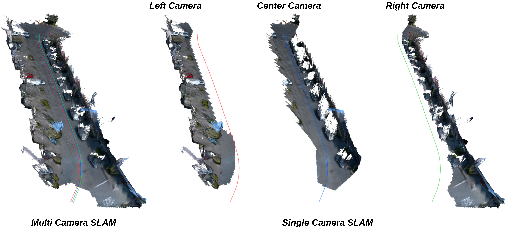

<h2 align="center"> <a href="https://mcgs-slam.github.io">MCGS-SLAM: A Multi-Camera SLAM Framework Using Gaussian Splatting for High-Fidelity Mapping</a>
</h2>

<h5 align="center">

[](https://arxiv.org/abs/2509.14191) 
[](https://mcgs-slam.github.io) 
[](https://2026.ieee-icra.org) 

Zhihao Cao, Hanyu Wu, Li Wa Tang, Zizhou Luo, Wei Zhang, Marc Pollefeys, Zihan Zhu*, Martin R. Oswald

*Project Lead
</h5>

<div align="center">
TL;DR: A dense SLAM system that leverages multi-camera input and 3D Gaussian Splatting.
</div>
<br>

<div align="center">
  
</div>
<br>

---

## 📦 Installation (pixi)

The project is fully self-contained with [pixi](https://pixi.sh): one lockfile
covers `linux-64` and `linux-aarch64` (DGX Spark / GB10), with PyTorch 2.13
(CUDA 13.0) from PyPI and the CUDA 13 build toolchain from conda-forge.
The only host requirement is an NVIDIA driver >= 580.

```bash
curl -fsSL https://pixi.sh/install.sh | bash   # if pixi is not installed
pixi run demo                                  # installs env, builds CUDA extensions,
                                               # downloads data + models, runs SLAM,
                                               # and writes a Rerun recording
```

Individual steps, if you want them separately:

```bash
pixi install        # create the locked environment
pixi run build      # compile droid_backends, lietorch, simple-knn, diff-gaussian-rasterization
```

The CUDA extensions are compiled for the arch in `TORCH_CUDA_ARCH_LIST`
(`12.1` on linux-aarch64 for the GB10, `8.9;12.0` on linux-64 — see
`pixi.toml`).

<details>
<summary>Legacy conda installation (upstream, CUDA 11.8)</summary>

```bash
conda env create -f environment.yaml
conda activate mcgs_slam_v1
conda install -c "nvidia/label/cuda-11.8.0" cuda-nvcc=11.8 cuda-cudart-dev=11.8
conda install -c "nvidia/label/cuda-11.8.0" cuda-toolkit
export CUDA_HOME=$CONDA_PREFIX
export CC=gcc-11
export CXX=g++-11
pip install -r requirement.txt --no-build-isolation
python setup.py install
```

</details>

---

## 📥 Download the Data

`pixi run demo` downloads the example sequence automatically. Manually:

```bash
wget https://polybox.ethz.ch/index.php/s/JAJpZb2RJAjd4Y5/download/data.zip
unzip data.zip
```

The sequence we provide here is derived from the [Waymo Open Dataset](https://waymo.com/open/). To avoid copyright issues, we only ship this single sequence as an example, for other sequences, please download them directly from [https://waymo.com/open/](https://waymo.com/open/).

In addition, Multi-Camera Airsim (MC-Airsim) Dataset is available from [https://mcgs-slam.github.io/dataset/](https://mcgs-slam.github.io/dataset/).

---

## 🚀 Run MCGS-SLAM

### With a Rerun recording (default)

```bash
pixi run demo          # writes output/100613/mcgs_slam.rrd
pixi run demo-viewer   # same run with a live Rerun viewer
```

The Rerun recording contains the multi-camera rig (frustums + images), the
per-keyframe estimated depth, the rig trajectory, and Gaussian-map snapshots
logged with the native `GaussianSplats3D` archetype (rerun >= 0.36).

### Manual invocation

```bash
export seq=data/100613
pixi run python demo.py --calib calib/100613.yml \
               --imagedir ${seq}/front ${seq}/front_right ${seq}/front_left ${seq}/front_right \
               --stride 1 \
               --output output/100613 \
               --rrd output/100613/mcgs_slam.rrd
```

`--rerun-spawn` opens a live viewer, `--rr-splat-every N` controls the
Gaussian snapshot cadence. The legacy OpenGL viewer is still available with
`--gsvis` (requires glfw/imgviz/pyopengl, not in the pixi env).

### ATE (RMSE)
```bash
evo_ape tum data/100613/gt_poses.txt output/100613/traj_mcgs.txt -as
```

### TSDF Visualization
```bash
python tsdf_integrate.py --result output/100613 --device cpu:0 --per_camera
python vis_tsdf_per_cam.py --result output/100613
```

---

## 🧪 Modes

### 1. **Full Optimization Mode (MCBA + JDSA + Prior Depth)**

This mode uses multi-camera bundle adjustment with joint depth–scale alignment and prior-guided depth initialization.

```bash
export seq=data/100613
python demo.py --calib calib/100613.yml \
                         --imagedir ${seq}/front ${seq}/front_right ${seq}/front_left ${seq}/front_right \
                         --stride 1 \
                         --output output/100613 \
                         --prgbd --jdsa
```

### 2. **MCBA + Prior Depth Only (without JDSA)**

JDSA is disabled. Depth is still initialized via priors (e.g., Metric3D).

```bash
export seq=data/100613
python demo.py --calib calib/100613.yml \
                         --imagedir ${seq}/front ${seq}/front_right ${seq}/front_left ${seq}/front_right \
                         --stride 1 \
                         --output output/100613 \
                         --prgbd
```

### 3. **Minimal Optimization Mode (No Prior, No JDSA)**

A simpler version of our method using only multi-view photometric and geometric consistency.

```bash
export seq=data/100613
python demo.py --calib calib/100613.yml \
                         --imagedir ${seq}/front ${seq}/front_right ${seq}/front_left ${seq}/front_right \
                         --stride 1 \
                         --output output/100613
```

---

## 🛠️ Dependencies

* Python 3.8+
* PyTorch >= 1.13.0 (CUDA 11.8)
* OpenMMLab stack: `mmengine`, `mmcv`
* NumPy, OpenCV, PyYAML, etc. (installed via `environment.yaml`)

---

## 📸 Citation and Acknowledgement

If you find this project useful, please consider citing our paper.

```
@article{cao2025mcgs,
  title={Mcgs-slam: A multi-camera slam framework using gaussian splatting for high-fidelity mapping},
  author={Cao, Zhihao and Wu, Hanyu and Tang, Li Wa and Luo, Zizhou and Zhang, Wei and Pollefeys, Marc and Zhu, Zihan and Oswald, Martin R},
  journal={arXiv preprint arXiv:2509.14191},
  year={2025}
}
```

Parts of the code are adapted or reimplemented based on ideas from [BAMF-SLAM](https://arxiv.org/abs/2306.01173), [Hi-SLAM2](https://arxiv.org/abs/2411.17982), and [3D Gaussian Splatting](https://repo-sam.inria.fr/fungraph/3d-gaussian-splatting/).